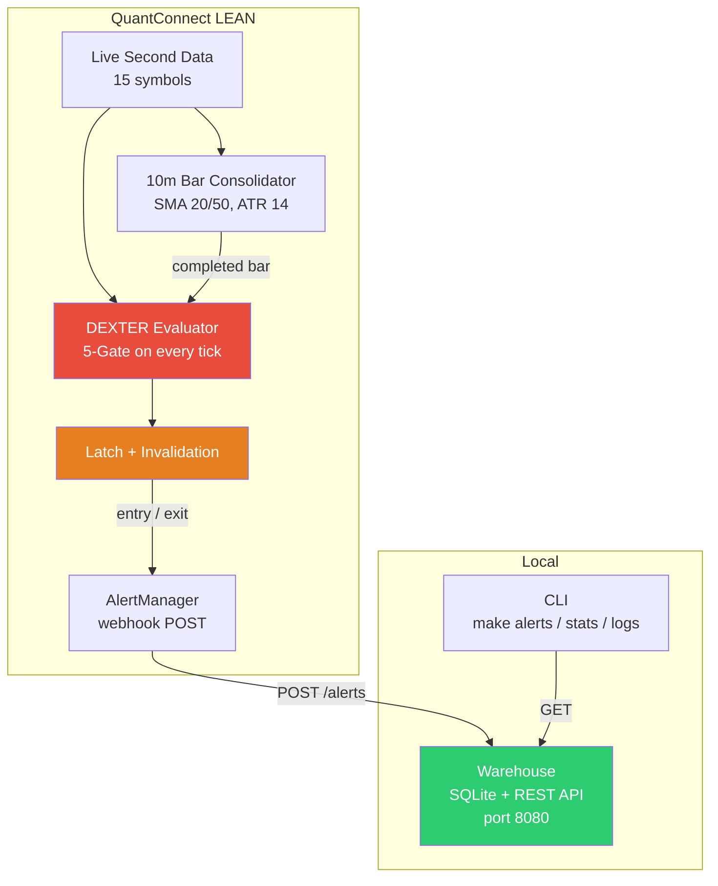

# Dipsea — DEXTER Real-Time Alert Monitor

Real-time implementation of the DEXTER (Shoulder Tap 2) compressed-volatility breakout strategy. Runs on QuantConnect LEAN with second-resolution live data, evaluates a 5-gate signal on every price update, and posts alerts to a local warehouse via webhook.

## Strategy

DEXTER identifies stocks in a clear trend, waits for a period of low-volatility consolidation, then triggers when price breaks out of a 10-bar range with above-average volume. All 5 gates must pass simultaneously for a signal to fire.

| Gate | Condition | Purpose |
|------|-----------|---------|
| **1. MA Alignment** | SMA(20) vs SMA(50) position | Establishes trend direction (BULL/BEAR) |
| **2. Slope Agreement** | Both SMAs slope in the same direction | Confirms momentum |
| **3. ATR Compression** | ATR(14) / Close <= 0.008 | Identifies volatility squeeze |
| **4. 10-Bar Breakout** | Live price breaks the 10-bar high/low channel | Price action confirmation |
| **5. RVOL (TOD)** | Time-of-day relative volume >= 1.2x | Volume validation against 60-day baseline |

Gates 1-3 use indicators from the last completed 10-minute bar. Gates 4-5 use the live price and accumulating volume, evaluated on every second.

Signal strength is scored 60-100 based on RVOL magnitude and MA slope agreement.

### Latch / Invalidation

When a signal fires, a latch engages to prevent duplicate alerts:

- **Same bar**: latch suppresses re-trigger, checks for invalidation
- **New bar**: latch does not suppress -- new signals can fire independently
- **Invalidation**: if price falls back inside the channel, an exit alert is posted with the original `entry_timestamp`
- **TTL**: latch silently expires after 10 minutes if not invalidated

## Architecture



## Quickstart

### Prerequisites

- Docker and Docker Compose
- GNU Make
- Python 3.13+
- QuantConnect account with developer subscription
- LEAN CLI (`pip install lean`) authenticated (`lean login`)

### 1. Start the warehouse

```bash
make warehouse
```

Starts the SQLite-backed alert warehouse on port 8080.

### 2. Deploy LEAN live (cloud)

```bash
make live
```

Pushes the strategy to QuantConnect and deploys on your L-MICRO node with paper trading. Evaluates all 15 symbols at second resolution.

### 3. Or run LEAN locally

```bash
make local
```

Runs the same LEAN algorithm locally via Docker.

### 4. Query alerts

```bash
make alerts              # all stored alerts
make alerts-aapl         # filter by symbol
make stats               # per-symbol aggregate stats
make latest              # most recent alert per symbol
make health              # warehouse health check
make logs                # pull live algorithm logs from QC
```

### 5. Manage deployment

```bash
make status              # cloud deployment status
make stop                # stop cloud live (keep positions)
make liquidate           # stop + close all positions
make backtest            # run cloud backtest
make local-backtest      # run local backtest
make push                # push code to QC without deploying
```

### 6. Tear down

```bash
make down                # stop warehouse
make nuke                # stop warehouse + delete stored data
make clean               # remove Python build artifacts
```

### 7. Development

```bash
pip install -r python/requirements-dev.txt
make test                # run tests
make lint                # ruff linter
make lint-fix            # auto-fix lint issues
```

## Alert Payload

When a signal fires, LEAN POSTs this JSON to the warehouse:

```json
{
  "timestamp": "2026-03-31T14:45:00",
  "symbol": "AAPL",
  "price": 253.79,
  "alert_type": "DEXTER",
  "entry_exit": "entry",
  "side": "buy",
  "bar_size": "10m",
  "strength": 72,
  "source": "lean-cloud"
}
```

Exit (invalidation) alerts include the original entry timestamp:

```json
{
  "timestamp": "2026-03-31T14:52:30",
  "symbol": "AAPL",
  "price": 252.10,
  "alert_type": "DEXTER",
  "entry_exit": "exit",
  "side": "",
  "bar_size": "10m",
  "strength": 0,
  "source": "lean-cloud",
  "entry_timestamp": "2026-03-31T14:45:00"
}
```

## Project Structure

```
dexter/
├── lean/                        # QuantConnect LEAN strategy
│   └── ShoulderTaps/
│       ├── main.py              # Algorithm entry point (Resolution.Second)
│       ├── config.json          # Parameters + webhook config
│       ├── alpha/               # Signal evaluators
│       │   ├── dexter.py        # DEXTER 5-gate + latch/invalidation
│       │   ├── bt_divergence.py # Stochastic divergence (Tap 1)
│       │   ├── ensemble_a.py    # 7-gate momentum confluence (Tap 3)
│       │   ├── ensemble_b.py    # SPY scalp (Tap 4)
│       │   ├── ensemble_c.py    # Dual-TF reversal (Tap 5)
│       │   ├── utils.py         # Shared indicator utilities
│       │   └── proxies.py       # Market sentiment approximations
│       ├── execution/           # Order execution model
│       ├── notifications/       # AlertManager -> warehouse webhook
│       └── tracking/            # Trade metrics + forward returns
├── python/                      # Warehouse + utilities
│   ├── alert_warehouse.py       # Alert storage HTTP server
│   ├── qc_logs.py               # Pull live logs from QC API
│   └── requirements-dev.txt
├── docker/
│   ├── docker-compose.yml       # Warehouse container
│   └── Dockerfile.warehouse
├── tests/
├── Makefile
└── .gitignore
```

## License

[MIT](LICENSE) © 2026 Martin Forde <mforde84@gmail.com>, [Blik Labs](https://bliklabs.com).
