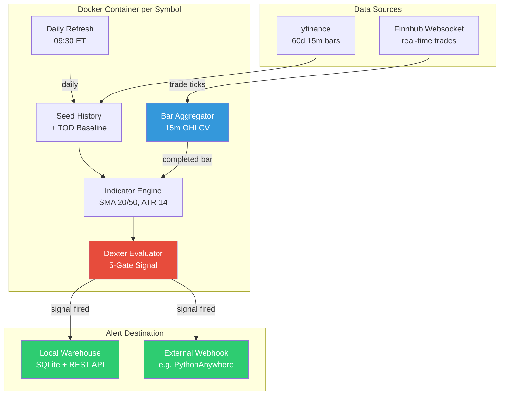
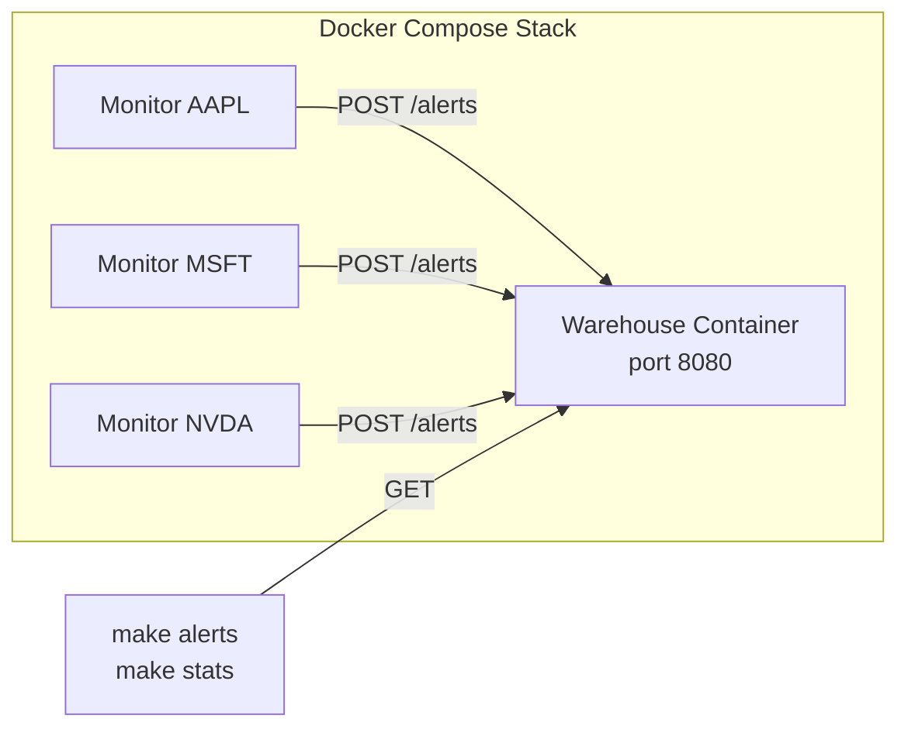

# DEXTER Real-Time Alert Monitor

Real-time implementation of the DEXTER compressed-volatility breakout strategy. Streams live market data, evaluates a 5-gate signal on every completed 15-minute bar, and posts alerts to a configurable webhook endpoint.

## Strategy

DEXTER identifies stocks in a clear trend, waits for a period of low-volatility consolidation, then triggers when price breaks out of a 10-bar range with above-average volume confirming the move. All 5 gates must pass on the same bar for a signal to fire.

| Gate | Condition | Purpose |
|------|-----------|---------|
| **1. MA Alignment** | SMA(20) > SMA(50) = BULL, SMA(20) < SMA(50) = BEAR | Establishes trend direction |
| **2. Slope Agreement** | Both SMA(20) and SMA(50) slope in the same direction | Confirms momentum |
| **3. ATR Compression** | ATR(14) / Close <= 0.008 | Identifies volatility squeeze before breakout |
| **4. 10-Bar Breakout** | Close breaks above/below the 10-bar high/low channel | Price action confirmation |
| **5. RVOL (TOD)** | Time-of-day relative volume >= 1.2x | Volume validation against 60-day baseline |

Signal strength is scored 60-100 based on RVOL magnitude and MA slope agreement.

## Architecture





## Quickstart

### Prerequisites

- Docker and Docker Compose
- GNU Make
- (Optional) Python 3.13+ for running tests locally

### 1. Run with local warehouse

```bash
make up SYMBOLS="AAPL MSFT NVDA"
```

This starts one monitor container per symbol plus a local SQLite-backed warehouse on port 8080. Monitors seed with 60 days of history, then stream live trades during market hours.

### 2. Query alerts

```bash
make alerts              # all stored alerts
make alerts-aapl         # filter by symbol
make stats               # per-symbol aggregate stats
make latest              # most recent alert per symbol
make health              # warehouse health check
```

### 3. Run with external webhook

```bash
make up \
  SYMBOLS="AAPL MSFT NVDA GOOGL META" \
  WEBHOOK_URL="https://alerts-grantsea.pythonanywhere.com/api/alert" \
  WEBHOOK_API_KEY="your-api-key"
```

No local warehouse is started. Monitors post directly to the external endpoint with `X-API-Key` auth.

### 4. Manage monitors

```bash
make add SYMBOLS="GOOGL META"    # add to running stack
make remove SYMBOLS="META"       # remove specific monitor
make restart SYMBOLS="AAPL"      # restart a monitor
make logs                        # tail all logs
make logs-aapl                   # tail one monitor
make status                      # show containers
```

### 5. Tear down

```bash
make down       # stop all containers
make nuke       # stop + delete stored data
make clean      # remove Python build artifacts
```

### 6. Development

```bash
pip install -r python/requirements-dev.txt
make test       # 100 tests with coverage
make lint       # ruff linter
make lint-fix   # auto-fix lint issues
```

## Alert Payload

When a signal fires, the monitor POSTs this JSON to the webhook:

```json
{
  "timestamp": "2026-03-31T14:45:00",
  "symbol": "AAPL",
  "price": 253.79,
  "alert_type": "DEXTER",
  "entry_exit": "entry",
  "side": "buy",
  "bar_size": "15m"
}
```

## Project Structure

```
dipsea/
├── python/
│   ├── dexter_alert.py          # DEXTER evaluator + monitor
│   ├── stock_stream.py          # Historical bars + trade streaming
│   ├── alert_warehouse.py       # Alert storage HTTP server
│   ├── requirements.txt         # Pinned runtime dependencies
│   └── requirements-dev.txt     # + test/lint dependencies
├── docker/
│   ├── docker-compose.yml       # Warehouse service
│   ├── docker-compose.override.yml  # Generated monitor services
│   ├── Dockerfile.monitor
│   └── Dockerfile.warehouse
├── tests/
│   ├── conftest.py
│   ├── test_dexter_alert.py
│   ├── test_alert_warehouse.py
│   └── test_stock_stream.py
├── Makefile
└── .gitignore
```
