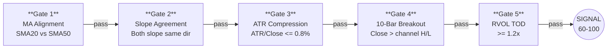
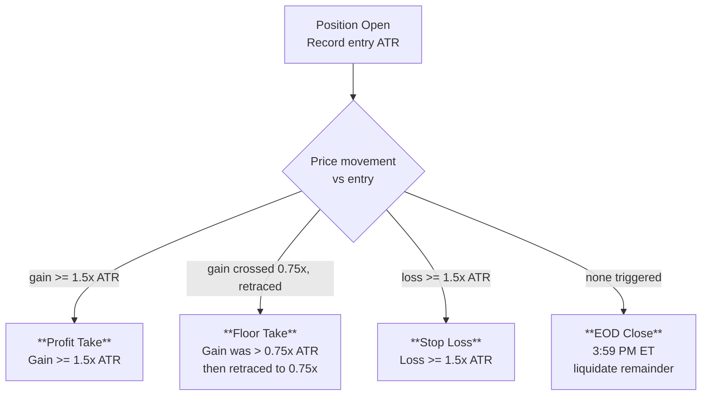

# DEXTER Research Brief

## Strategy Overview

Dexter is a **compressed-volatility breakout signal** that identifies stocks in a clear trend (moving averages aligned and sloping together), waits for a period of low volatility consolidation, then triggers when price breaks out of a 10-bar range with above-average volume confirming the move.

Volume is the **confirmation gate**, not the driver. The core thesis is that tight consolidations within an established trend resolve as continuation breakouts, and elevated relative volume validates the breakout as institutional rather than noise.

Dexter runs entirely on **L1 market data** (SMA, ATR, OHLCV) with no proxies or proprietary feeds.

---

## Signal Gates

All 5 gates must pass on the same 10-minute bar for a signal to fire:



| Gate | Condition | Purpose |
|------|-----------|---------|
| **1. MA Alignment** | SMA(20) > SMA(50) = BULL; SMA(20) < SMA(50) = BEAR | Establishes trend direction |
| **2. Slope Agreement** | Both SMA slopes must match direction (both > 0 or both < 0) | Confirms trend momentum, not just crossover |
| **3. ATR Compression** | ATR(14) / Close <= 0.008 (0.8%) | Identifies volatility coil / consolidation |
| **4. 10-Bar Breakout** | BULL: Close > max(prior 10 highs); BEAR: Close < min(prior 10 lows) | Price breaks the consolidation range |
| **5. RVOL TOD** | Current volume / avg volume at same time-of-day >= 1.2x | Confirms institutional participation |

**Additional controls:**
- **10-minute cooldown** per symbol (matches bar timeframe — re-entry requires a new 10m bar to confirm setup)

---

## Exit Strategy

Exits are **ATR-relative** — scaled to each security's reported volatility. Three exit types, checked on every 1-minute bar:



| Exit | Trigger | Purpose |
|------|---------|---------|
| **Profit Take** | Gain >= 1.5x ATR(14) at entry | Lock in full target when breakout extends |
| **Floor Take** | Gain crossed 0.75x ATR, then retraces back to 0.75x | Capture partial winners before they reverse |
| **Stop Loss** | Loss >= 1.5x ATR(14) at entry | Cap downside on failed breakouts |
| **EOD Close** | 3:59 PM ET | Flat overnight, no gap risk |

The **trailing floor** is the key mechanism: once a trade proves itself by reaching 0.75x ATR in profit, the 0.75x level becomes a locked-in minimum exit. The trade can still run to the full 1.5x target, but if it pulls back, it exits at 0.75x instead of bleeding to the stop loss or EOD.

**Late-day entry cutoff:** No new positions after 15:45 ET. Signals fired on 10-minute bars consolidated at 16:00 (market close) would open after the 15:59 EOD liquidation, causing overnight carries. The cutoff also prevents entries with insufficient time to resolve before EOD.

---

## Candidate Universe

15 mid/large cap equities selected for Dexter's ATR compression gate:

| # | Ticker | Name | Sector |
|---|--------|------|--------|
| 1 | AAPL | Apple | Tech |
| 2 | MSFT | Microsoft | Tech |
| 3 | GOOGL | Alphabet | Tech |
| 4 | AMZN | Amazon | Tech/Retail |
| 5 | META | Meta | Tech |
| 6 | NVDA | Nvidia | Semis |
| 7 | AVGO | Broadcom | Semis |
| 8 | JPM | JPMorgan | Financials |
| 9 | V | Visa | Financials |
| 10 | GS | Goldman Sachs | Financials |
| 11 | UNH | UnitedHealth | Healthcare |
| 12 | LLY | Eli Lilly | Healthcare |
| 13 | COST | Costco | Consumer |
| 14 | HD | Home Depot | Consumer |
| 15 | CRM | Salesforce | Enterprise SW |

**Selection criteria:** Market cap >$200B, average daily volume >10M shares, ATR/close ratio structurally below the 0.8% compression threshold, sector diversity, sufficient intraday range for profitable breakout-to-EOD trades.

**Excluded:** SPY and QQQ. Their intraday range is too narrow for meaningful breakout trades, and their ATR ratio is so low (~0.1-0.2%) that the compression gate never filters, effectively reducing Dexter to a 3-gate model.

---

## Backtest Results

**Environment:** QuantConnect Lean (local Docker), minute-resolution data from yfinance, Feb 2-13 2026 (10 trading days). $500,000 starting equity, 100-share lots per trade.

| Metric | Value |
|--------|-------|
| Signals | 112 |
| Completed Trips | 87 |
| Win Rate | 58.6% |
| Total P&L | +$1,681 |
| Avg P&L/Trade | +$19.32 |
| Profit Factor | 1.20 |
| Expectancy | +$19.32 |
| Sharpe | +0.064 |
| Sortino | +0.091 |
| Max Drawdown | $3,390 |
| Avg Hold Time | 45 min |

### Cooldown Sweep

Cooldown controls how quickly Dexter can re-enter the same symbol after an exit. Tested with 1.5x PT / 0.75x floor / 1.5x SL:

| Cooldown | Signals | Trips | WR | P&L | PF | Max DD |
|----------|---------|-------|----|-----|-----|--------|
| 60 min | 71 | 62 | 56.5% | +$893 | 1.13 | $3,154 |
| **10 min** | **112** | **87** | **58.6%** | **+$1,681** | **1.20** | **$3,390** |
| 5 min | 215 | 108 | 60.2% | +$614 | 1.06 | $3,906 |
| 1 min | 1,029 | 132 | 55.3% | -$1,399 | 0.90 | $4,180 |

**10 minutes is the sweet spot** — it matches the bar timeframe, so re-entry requires a new 10m bar to confirm the setup still exists. Shorter cooldowns allow rapid-fire re-entries on the same bar after stop-outs (COST stopped 3x in 5 minutes at 1min CD). Longer cooldowns miss profitable re-entries when a setup persists across multiple bars.

### Exit Tuning Grid

All configurations tested with 15:45 ET entry cutoff, 60-min cooldown, TOD RVOL:

| PT | Floor | SL | Trips | WR | P&L | PF | Max DD |
|----|-------|----|-------|----|-----|-----|--------|
| **1.5** | **0.75** | **1.5** | **62** | **56.5%** | **+$893** | **1.13** | **$3,154** |
| 1.5 | 0.75 | 1.25 | 62 | 53.2% | +$289 | 1.04 | $3,214 |
| 2.0 | 1.0 | 1.5 | 62 | 56.5% | +$265 | 1.03 | $3,443 |
| 1.5 | 1.0 | 1.5 | 62 | 58.1% | +$238 | 1.03 | $3,341 |
| 2.0 | 1.25 | 1.5 | 62 | 54.8% | +$82 | 1.01 | $3,319 |
| 1.5 | 1.25 | 1.5 | 62 | 56.5% | +$65 | 1.01 | $3,287 |
| 1.5 | 1.0 | 1.25 | 62 | 54.8% | -$260 | 0.97 | $3,326 |
| 2.0 | 1.5 | 1.5 | 62 | 53.2% | -$319 | 0.96 | $3,453 |

The **0.75x floor** is the key differentiator. Lowering the floor from 1.0x to 0.75x captures retracements earlier — before they have time to reverse into stop-outs. This nearly doubled the floor take count (10 → 20 trades) while keeping 75% win rate on floor exits.

### Exit Type Breakdown

| Exit Type | Trips | Win Rate | P&L | Avg P&L | Avg Hold |
|-----------|-------|----------|-----|---------|----------|
| **Profit Take (1.5x ATR)** | 26 | 100% | +$7,750 | +$298 | 43 min |
| **Floor Take (0.75x ATR retrace)** | 29 | 75.9% | +$2,029 | +$70 | 30 min |
| Stop Loss (1.5x ATR) | 24 | 0% | -$7,378 | -$307 | 71 min |
| EOD (remainder) | 8 | 37.5% | -$720 | -$90 | 24 min |

### Per-Symbol Performance

| Ticker | Trips | WR | P&L | Avg P&L | Avg Win | Avg Loss | Best | Worst | Hold | PT | FL | SL | EOD |
|--------|-------|----|-----|---------|---------|----------|------|-------|------|----|----|----|-----|
| GS | 10 | 90.0% | +$2,446 | +$245 | +$320 | -$430 | +$741 | -$430 | 12m | 3 | 5 | 0 | 2 |
| JPM | 8 | 62.5% | +$772 | +$96 | +$243 | -$148 | +$939 | -$255 | 85m | 2 | 3 | 2 | 1 |
| MSFT | 4 | 75.0% | +$564 | +$141 | +$191 | -$10 | +$287 | -$10 | 84m | 2 | 2 | 0 | 0 |
| GOOGL | 7 | 57.1% | +$404 | +$58 | +$190 | -$119 | +$347 | -$206 | 15m | 3 | 1 | 2 | 1 |
| V | 4 | 75.0% | +$302 | +$75 | +$166 | -$197 | +$303 | -$197 | 86m | 2 | 1 | 1 | 0 |
| HD | 3 | 66.7% | +$217 | +$72 | +$246 | -$276 | +$427 | -$276 | 13m | 1 | 1 | 1 | 0 |
| AMZN | 7 | 57.1% | +$101 | +$14 | +$70 | -$60 | +$126 | -$166 | 55m | 2 | 4 | 1 | 0 |
| AAPL | 8 | 50.0% | -$38 | -$5 | +$237 | -$246 | +$654 | -$560 | 87m | 2 | 1 | 4 | 1 |
| NVDA | 5 | 40.0% | -$39 | -$8 | +$93 | -$75 | +$169 | -$213 | 10m | 1 | 2 | 1 | 1 |
| AVGO | 7 | 71.4% | -$94 | -$13 | +$169 | -$469 | +$274 | -$601 | 49m | 3 | 2 | 2 | 0 |
| UNH | 1 | 0.0% | -$202 | -$202 | $0 | -$202 | $0 | -$202 | 18m | 0 | 0 | 1 | 0 |
| META | 1 | 0.0% | -$410 | -$410 | $0 | -$410 | $0 | -$410 | 10m | 0 | 0 | 1 | 0 |
| CRM | 15 | 46.7% | -$450 | -$30 | +$115 | -$157 | +$179 | -$337 | 47m | 4 | 5 | 5 | 1 |
| COST | 6 | 50.0% | -$658 | -$110 | +$192 | -$412 | +$253 | -$431 | 10m | 1 | 2 | 2 | 1 |
| LLY | 1 | 0.0% | -$1,234 | -$1,234 | $0 | -$1,234 | $0 | -$1,234 | 10m | 0 | 0 | 1 | 0 |

**Observations:**
- **9 of 15 symbols profitable** — GS leads at +$2,446 (90% WR, 10 trips, zero stop-outs)
- **10-min cooldown unlocked GS**: 3 more profitable re-entries vs 60-min cooldown, all winners
- **MSFT 75% WR** — 4 trips, only 1 minor floor loss (-$10), all exits via PT or floor
- **AAPL** nearly breakeven (-$38) despite 4 stop-outs, thanks to two big winners (+$654, +$114)
- **LLY** remains the biggest drag (-$1,234) — its ATR ($5.78) is so large that a single 1.5x ATR stop costs $867+
- **CRM** the most active symbol (15 trips) but negative — high churn with 5 stop-outs

---

## Implementation Notes

### RVOL TOD Baseline

The spec calls for a **40-day** time-of-day volume baseline:

```
RVOL_TOD = CurrentVolume / AvgVol_TOD_40
```

**This is not a blocker.** TOD RVOL is fully operational. The code accumulates volume history per 10-minute time slot during warmup and trading. `calc_rvol_tod()` requires a minimum of 5 entries per slot before producing a value, so signals self-gate until enough data exists. In our backtest, each slot has ~8-10 days of history by the time trading starts.

The implementation caps stored history at **30 days** (the yfinance 1-minute data limit). The spec's 40-day target would provide a more stable per-slot average (more history = less noise in the baseline), but is an **accuracy improvement**, not a functional requirement.

**To achieve the full 40-day baseline**, local data download via the Lean CLI requires an active subscription to the **QuantConnect US Equity Security Master**:

| QC Organization Tier | Annual Cost |
|---------------------|-------------|
| Quant Researcher | $600/yr |
| Team | $900/yr |
| Trading Firm | $1,200/yr |
| Institution | $1,800/yr |

This subscription enables `lean data download` for minute-resolution US equity data with full historical depth. Without it, cloud backtests on quantconnect.com (free tier) have full data access but cannot be triggered via the CLI API — they must be run manually from the web interface.

### Invalidation Gate (Disabled)

The spec defines an invalidation rule: "Bull invalidated if close falls back below channel high." This was implemented and tested but **disabled** — it produced 8.7% win rate across 28 exits, bleeding -$7,795. The gate is too aggressive for short intraday holds where price frequently whipsaws through breakout levels before continuing in the breakout direction. The ATR-based stop loss provides better risk management for automated trading.

### Spec Compliance Status

| Item | Spec | Implementation | Status |
|------|------|----------------|--------|
| MA alignment (20/50 stack + slope) | SMA20 vs SMA50, both slope same direction | Identical | Done |
| Compression gate | ATR(N)/Close <= threshold | ATR(14)/Close <= 0.008 | Done |
| 10-bar breakout | Close > Highest(High,10)[1] or < Lowest(Low,10)[1] | Identical | Done |
| RVOL TOD | CurrentVolume / AvgVol_TOD >= 1.2 | 30-day cap, 5-entry minimum | Done |
| No simple RVOL fallback | TOD-only, no fallback | Removed simple RVOL fallback | Done |
| Invalidation | Close back inside range = exit | Implemented but disabled (8.7% WR) | Tested |
| Cooldown | Not in spec (discretionary signal) | 10 min per symbol (matches bar TF) | Added |
| ATR exits | Not in spec | 1.5x PT with 0.75x floor + 1.5x SL | Added |
| Late-day cutoff | Not in spec | No new entries after 15:45 ET | Added |

---

## Other Alpha Models

**Ensemble B (SPY scalp):** Performed well in initial testing (100% win rate) but on only 2 completed trades. All 5 gates rely on proxy approximations of proprietary data feeds (NYSE TICK, HIRO). The proxy quality is questionable — SAM returned the same constant value (-4.0) on every signal. QuantConnect's data library does not carry the underlying feeds ($TICK, $TRIN, $ADD, HIRO) needed to improve these proxies.

**BT Divergence, Ensemble A, Ensemble C:** Did not fire in the test period. BT Divergence is a genuinely rare reversal pattern; Ensemble A was blocked by empty VIX data in the local backtest; Ensemble C has a VWAP calculation bug (per-bar typical price instead of cumulative intraday VWAP) that makes the 1% stretch gate nearly impossible to pass.

---

## QuantConnect Pricing

Minimum tier for live alerts, paper trading, and backtesting:

**Researcher: $60/month ($720/year)**

| Capability | Researcher Tier |
|-----------|----------------|
| Live algorithms | 1 (L-MICRO node) |
| Webhook alerts | 20/hr limit |
| Email alerts | 20/hr limit |
| Minute-resolution data | Included (US equities) |
| API access | Included |
| US Equity Security Master | +$600/yr (enables local data download, 40-day TOD baseline) |

At 15 symbols with a 10-minute cooldown and signals concentrated in the last 90 minutes of trading, realistic signal volume is 10-20 per day — within the 20/hr alert limit.

---

## Next Steps

1. **Longer backtest window** — 2 weeks is insufficient to validate. Need 3-6 months minimum via QC cloud backtest (free) or Security Master subscription ($600/yr) for local runs.
2. **Position sizing** — LLY's -$1,234 loss on a single trade still dominates. ATR-based position sizing (normalize dollar risk per trade) would prevent any one stock from outsized impact.
3. **Universe refinement** — LLY (0% WR, -$1,234) and CRM (25% WR, -$651) may not fit Dexter's thesis. Remove after longer validation.
4. **Time-based stop** — Tested at 90m and 120m but hurt P&L by cutting some long-running winners early. Revisit with a longer backtest window to see if the benefit of cutting slow bleeders outweighs the cost of cutting slow winners.
